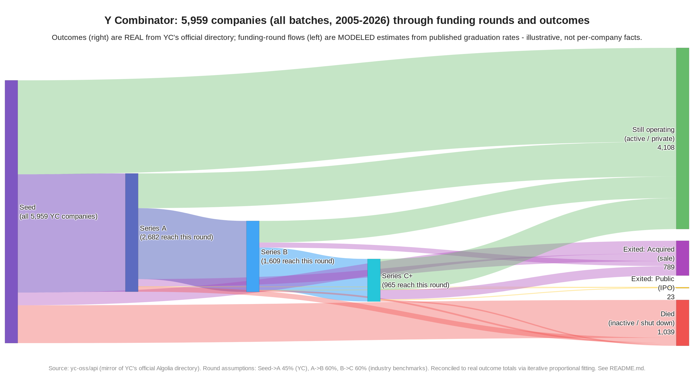

# Y Combinator companies — funding rounds & outcomes Sankey

A Sankey chart of **all current and past Y Combinator companies** (every batch
from Summer 2005 through 2026), showing the funding rounds they progressed
through and how each ended up: **still active**, **acquired (sale)**,
**public (IPO)**, or **inactive (shut down / died)**.



- **`yc_sankey.html`** — interactive version (hover for exact counts). Open in any browser.
- **`yc_sankey.png`** — static render.
- **`build_sankey.py`** — fully reproducible generator (every number is a documented constant).
- **`yc_companies_snapshot.json`** — the raw source data this snapshot was built from.

## ⚠️ Read this before trusting the numbers

This chart mixes **two kinds of data**, and they are *not* equally reliable:

| Layer | What | Reliability |
|-------|------|-------------|
| **Outcomes** (right side) | Active / Acquired / Public / Inactive | ✅ **Real**, exact, from YC's official directory |
| **Funding rounds** (left side) | Seed → Series A → Series B → Series C+ | ⚠️ **Modeled estimate** from published aggregate rates |

**Why the rounds are estimated:** YC does not publish per-company funding-round
history, and the only comprehensive sources are paywalled (Crunchbase) or
proprietary (e.g. Rebel Fund's dataset). There is no free, accurate
"which round did each of ~6,000 companies reach" dataset. So the round
progression is *reconstructed* from published graduation rates — it shows the
realistic **shape** of the YC funnel, not the literal path of each company.

## The real numbers (from YC's directory)

Snapshot of **5,959 companies**:

| Outcome | Count | Share |
|---------|------:|------:|
| Still operating (active / private) | 4,108 | 68.9% |
| Exited — Acquired (sale) | 789 | 13.2% |
| Died (inactive / shut down) | 1,039 | 17.4% |
| Exited — Public (IPO) | 23 | 0.4% |

These four totals are taken verbatim from the data and are the **anchors** of
the chart — the modeled layer is bent to fit them exactly (see below).

## Assumptions for the (estimated) round layer

Round-to-round graduation rates — change them in `build_sankey.py` and re-run:

| Transition | Rate used | Basis |
|------------|----------:|-------|
| Seed → Series A | **45%** | YC-specific; YC companies raise Series A at ~45% vs. the ~30% market average |
| Series A → Series B | **60%** | Common industry benchmark (~60% A→B) |
| Series B → Series C+ | **60%** | Common industry benchmark (~60% B→C) |

Implied "furthest round reached":

| Round | Reach this round | Furthest stop here |
|-------|-----------------:|-------------------:|
| Seed (all companies) | 5,959 | 3,277 |
| Series A | 2,682 | 1,073 |
| Series B | 1,609 | 644 |
| Series C+ | 965 | 965 |

A **prior** for `P(outcome | stage)` encodes the obvious shape — later-stage
companies are less likely to die and more likely to exit, and IPOs are
essentially confined to the latest stages. The exact prior matrix is in
`build_sankey.py` (`PRIOR`).

## How the two layers are reconciled

The stage × outcome flow matrix is solved with **Iterative Proportional
Fitting (IPF / "raking")**:

- **Column totals** are pinned to the **real** outcome counts (4,108 / 789 / 23 / 1,039).
- **Row totals** are pinned to the **modeled** "furthest round reached" counts.
- Starting from the plausible `PRIOR`, the matrix is iteratively rescaled until
  both margins hold simultaneously.

Result — a single internally consistent flow where the real outcomes are exact
and the round shape follows the published rates (companies):

```
              Active   Acquired     Public   Inactive
  Seed         2,131        288          0        858
  Series A       786        172          1        115
  Series B       489        115          2         37
  Series C+      702        214         20         29
```

## Reproduce

```bash
pip install plotly==5.24.1 kaleido==0.2.1   # kaleido only needed for the PNG
python3 build_sankey.py
```

To refresh the underlying data:

```bash
curl -sSL https://raw.githubusercontent.com/yc-oss/api/main/companies/all.json \
  -o yc_companies_snapshot.json
```

## Sources

- **Company list & outcomes:** [`yc-oss/api`](https://github.com/yc-oss/api) —
  a public, daily-refreshed mirror of YC's official Algolia company directory
  ([ycombinator.com/companies](https://www.ycombinator.com/companies)).
- **Seed→A graduation (YC ~45%):** YC / Rebel Fund commentary on YC outcomes
  (see [Lenny's Newsletter on YC](https://www.lennysnewsletter.com/p/pulling-back-the-curtain-on-the-magic)).
- **A→B / B→C (~60%):** general venture graduation benchmarks
  ([Incisive Ventures](https://incisive.vc/2025/06/10/update-on-venture-graduation-rates/),
  [Chronograph](https://www.chronograph.pe/current-trends-in-the-series-a-and-seed-venture-markets/)).

Snapshot date: 2026-06-13.
